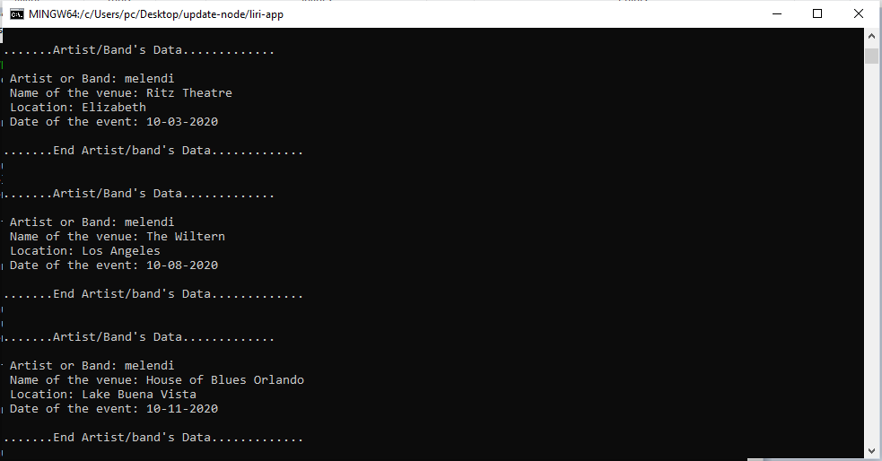
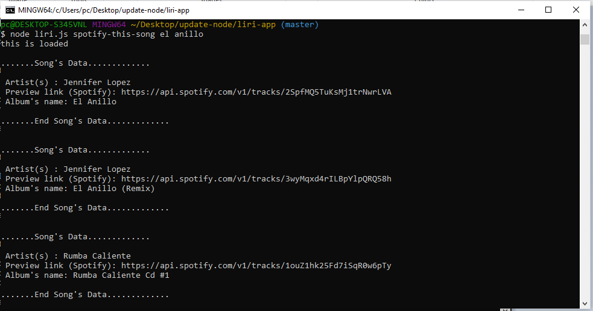
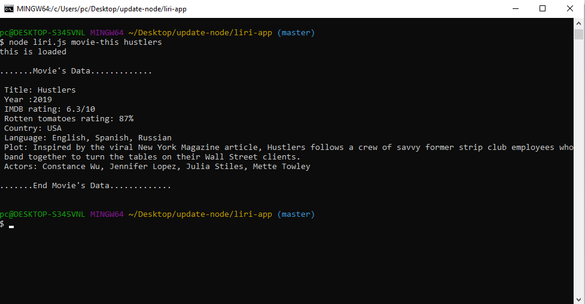

# Liri Bot
Liri is an application in node.js that executes defined command lines and returns valuable information.Include an .env file with ID and secret ID. If you gonna run this app you must to create your own .env file.

# How can I execute this app?
The user must execute one of the 4 commands defined:
* concert-this  <artist/band name here>

* spotify-this-song    <song name here>
 
 
 
* movie-this   <movie name here>
 
  
 
* do-what-it-says '<read data from random.txt>'
 
 
# Example

 node liri.js concert-this  melendi

# The information is obtained from : 
 * Spotify API
 * BandsInTown API
 * OMDB API
 
# Technologies
jQuery, Node.js

# Node modules
axios, moment, node-spotify-api, json , dotevn

